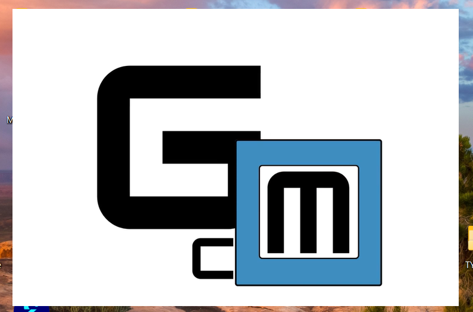
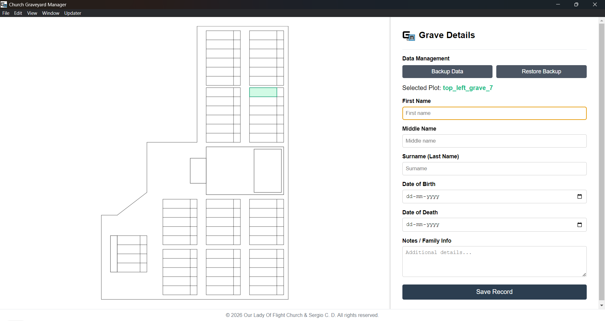
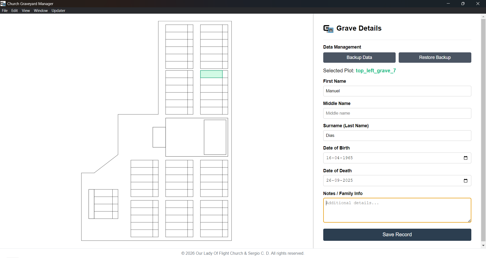
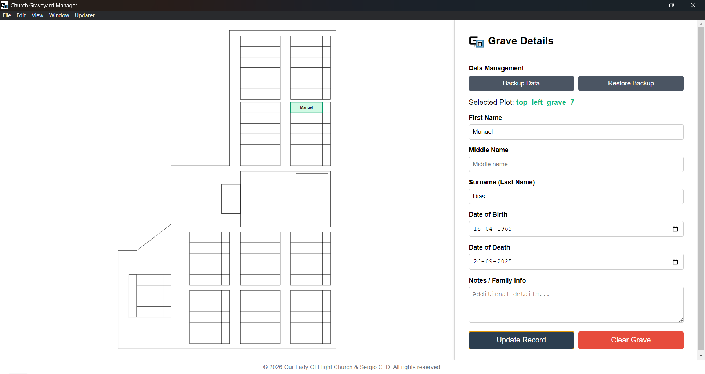
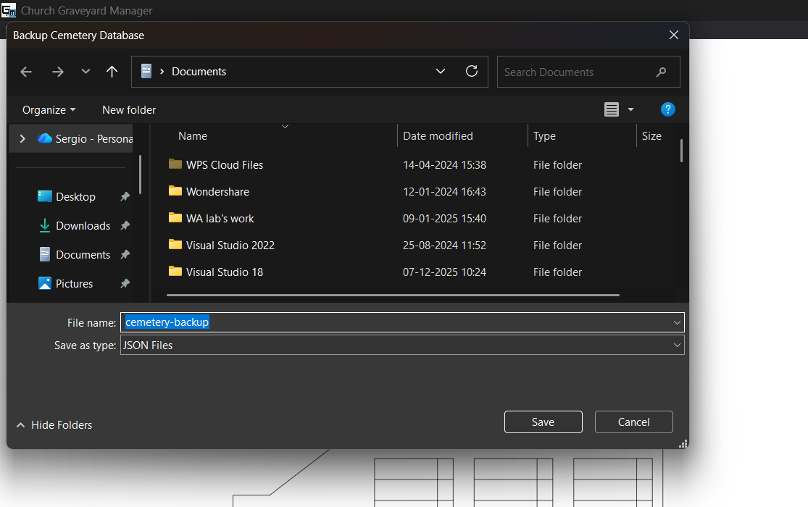
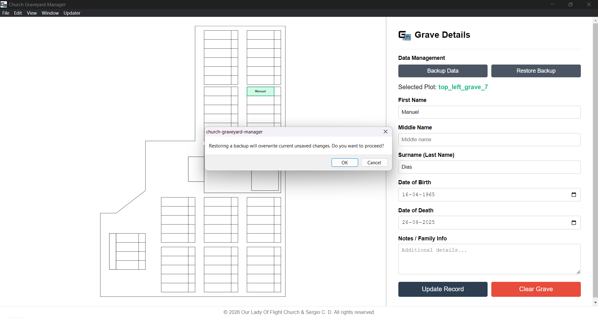

# church-graveyard-manager
🪦 Cemetery Mapping App
A desktop application built with Electron designed to digitize and manage church graveyard plots, track grave records, and export clean printable maps.

✨ Key Features
Interactive Map Management: Click directly on any individual plot on the map to enter, view, update, or clear burial and ownership data.

Data Backup & Restore: Safely backup your current database and restore records whenever needed to prevent data loss.

Built-in Updater: Easily check for new software versions straight from the app using the updater option in the top-left corner.

🛠️ Tech Stack
Framework: Electron (Node.js & Chromium)

Frontend: HTML5, CSS3, JavaScript, SVG

📦 Installation & Getting the App
Depending on whether you want to download and run the ready app or run the source code for development, choose the appropriate section below:

Option 1: For Regular Users (Download & Install)
Head over to the Releases Page of this repository.
https://github.com/SergioCarmoDias/church-graveyard-manager/releases

Download the latest installer file (e.g., .exe for Windows) for your operating system.

Run the installer to set up the app on your desktop. (Note: You can check for newer versions anytime using the built-in updater option in the top-left corner of the app!)

Option 2: For Developers (Running Source Code)
If you want to clone the repository and run the project locally for development:

Clone the repository:

Bash
git clone https://github.com/SergioCarmoDias/church-graveyard-manager.git
Navigate into the project directory:

Bash
cd church-graveyard-manager
Install dependencies:

Bash
npm install
Run the application:

Bash
npm start
